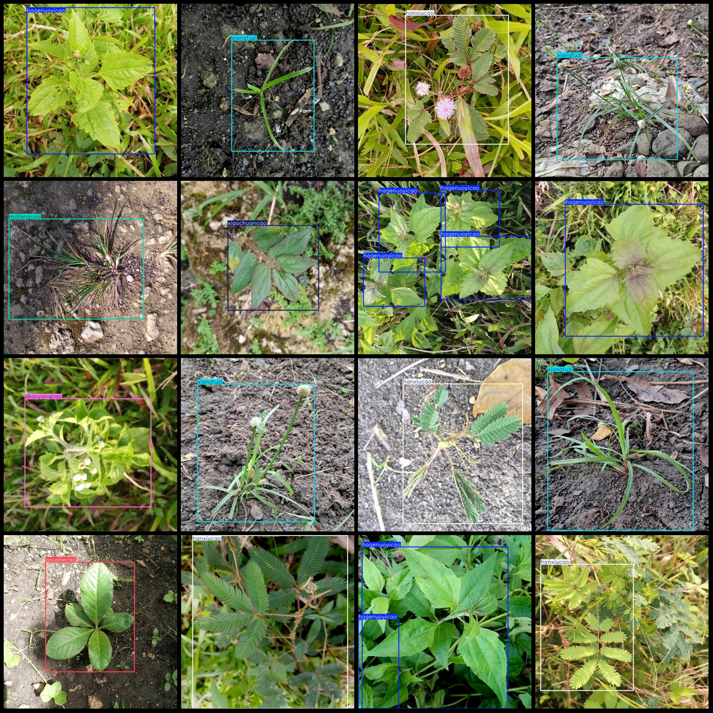
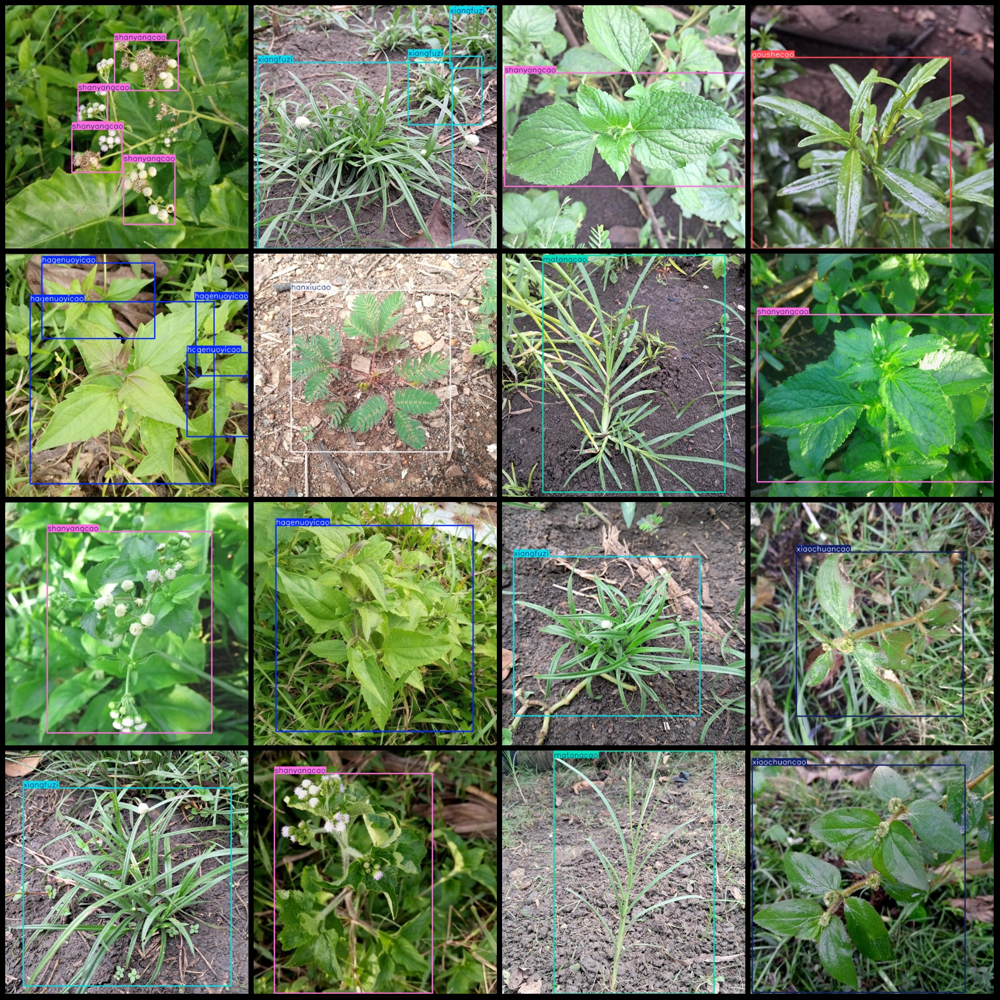

# Agricultural Weed Detection Dataset in Smart Farming: VOC+YOLO Format with 9249 Images of 8 Classes

The dataset format is Pascal VOC format+YOLO format. It does not include any split paths in the txt file, but it only contains the jpg images and the corresponding VOC format xml file and YOLO format txt file.
number of images: 9249  
annotation count: 9249  
annotation count: 9249  
annotationnumber of classes: 8  
annotation class names: ["goushecao", "guizhencao", "hagenuoyicao", "hanxiucao", "matangcao", "shanyangcao", "xiangfuzi", "xiaochuancao"]  
["Snake Plant", "Stinkweed", "Hedgehog Grass", "Buttercup", "Common Muhly", "Goat's-beard", "Atractylodes Macrocephala", "Asthma Herb"]
boxes per class:   
goushecao box count = 1540  
guizhencao box count = 1424  
hagenuoyicao box count = 2480  
hanxiucao box count = 2711  
matangcao box count = 1336  
shanyangcao box count = 1466  
xiangfuzi box count = 1581  
xiaochuancao box count = 1589  
total boxes: 14127  
images per class:   
goushecao images = 1042  
guizhencao images = 1147  
hagenuoyicao images = 1472  
hanxiucao images = 1677  
matangcao images = 1018  
shanyangcao images = 1134  
xiangfuzi images = 1107  
xiaochuancao images = 1225  
image resolution: 640x640  
Using the annotation tool: labelImg
Annotation rules: draw a rectangle around the class.
Important notes: The dataset needs to be divided into training, validation, and test sets. You need to do this yourself.
Special statement: This dataset does not guarantee the accuracy of the trained model or weight file.
Image preview:
## Images

Here is a pay link on Stripe ( https://buy.stripe.com/3cs8yP7sY87d0vu9AB ). Please contact me lonlonago@foxmail.com after funding $89, and I will send you a complete data files , thank you!

